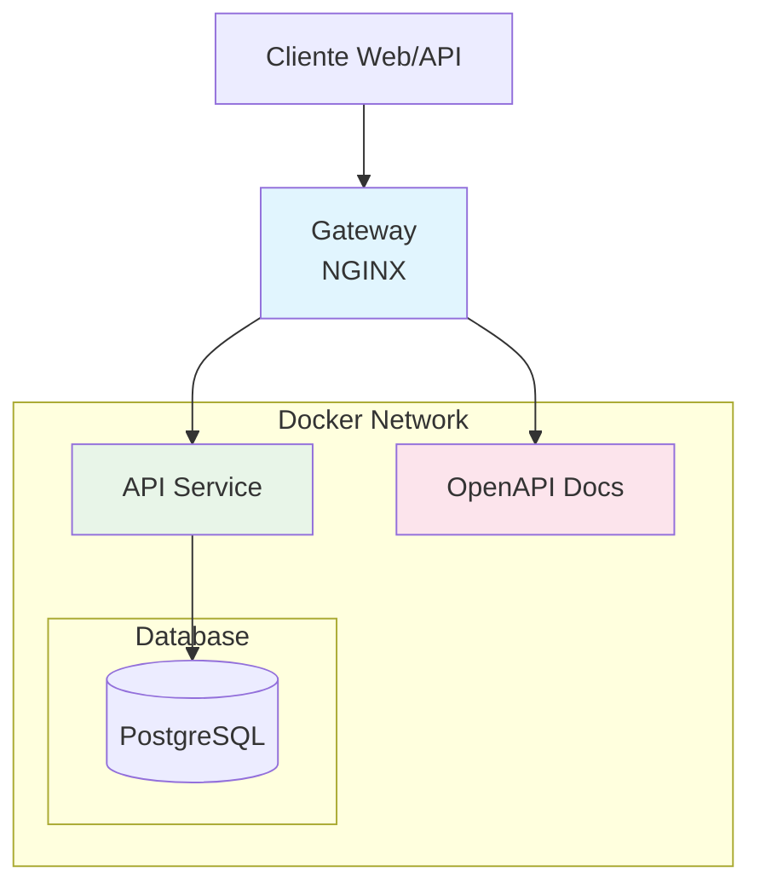

# Sistema de Gerenciamento de Apólices e Endossos

[Desenvolvimento](#desenvolvimento)
  - [Início Rápido](#início-rápido)
  - [Sistema de Configuração](#sistema-de-configuração)

[Arquitetura](#arquitetura-da-solução)

[Decisões Técnicas](#decisões-técnicas)
  - [Arquitetura do Monólito](#arquitetura-do-monólito)
  - [Testes](#testes)

## Desenvolvimento

O projeto utiliza **Docker** com **docker-compose** para orquestração completa de todos os serviços, garantindo isolamento e consistência entre ambientes. Para facilitar o desenvolvimento, foi implementado um sistema robusto de configuração em camadas.

### Início Rápido

Configure o ambiente de desenvolvimento com os comandos abaixo:

```bash
$ echo "SEGARANTE_ENVIRONMENT=development" >> .env.override
$ ./scripts/docker-compose up
```

> O script `scripts/docker-compose` é um **wrapper do Docker Compose** que carrega automaticamente as variáveis dos arquivos `.env` e `.env.override` antes de subir os containers. Também aplica automaticamente o `docker-compose.override.yml` quando presente, permitindo customizações locais sem alterar o arquivo base.

Após iniciar os serviços, acesse http://localhost/docs/openapi para visualizar a documentação completa da API. Para testar as requisições, você pode usar a [collection do Postman](./postman_collection.json) com exemplos prontos.

### Sistema de Configuração

O projeto utiliza um **sistema de configuração em camadas**.

#### **Variáveis de Ambiente**
1. **`.env`** - Configurações base do projeto (versionado)
2. **`.env.override`** - Sobrescreve configurações para desenvolvimento e produção (não versionado)

#### **Configuração Docker**
1. **`docker-compose.yml`** - Configuração base dos containers (versionado)
2. **`docker-compose.override.yml`** - Personalizações locais dos serviços (não versionado). Por padrão, apenas o gateway é exposto para o host, mantendo os serviços internos isolados. Para acessar serviços internos durante o desenvolvimento (ex: conectar IDE ao PostgreSQL), crie um `docker-compose.override.yml`:
	```yml
	services:
	  postgres:
	    ports:
	      - "${SEGARANTE_BIND_ADDRESS}:5432:5432"
	```

## Arquitetura da Solução



#### **Gateway**
- **Função**: Ponto único de entrada para todos os serviços- **Acesso Externo**: `${SEGARANTE_BIND_ADDRESS}:${SEGARANTE_HTTP_PORT}` (padrão: http://localhost)

#### **API Service**
- **Responsabilidade**: Gerenciamento completo de apólices de seguro e endossos
- **Funcionalidades**:
  - CRUD de apólices com geração automática de números únicos
  - CRUD de endossos com determinação automática de tipos
  - Validações de negócio e integridade referencial
  - Sistema de cancelamento com histórico preservado

#### **OpenAPI Service**
- **Responsabilidade**: Documentação interativa da API
- **Funcionalidades**:
  - Documentação OpenAPI 3.0 completa
  - Interface Swagger UI para testes

## Decisões Técnicas

### Arquitetura do Monólito

O projeto implementa uma **arquitetura simplificada** focada no domínio específico de seguros. A API Rails centraliza toda a lógica de negócio relacionada a apólices e endossos, mantendo a consistência dos dados e regras de negócio em um único serviço especializado.

Toda a comunicação externa passa pelo **gateway NGINX**, que roteia requisições para os serviços apropriados, mantendo uma interface única para clientes.

### Testes

A qualidade do código é garantida através de uma **estratégia abrangente de testes** que prioriza **testes de integração** sobre testes unitários isolados, focando em **validar rotas HTTP completas** e regras de negócio. Testes unitários são implementados quando necessario (veja `api/spec/app/contracts/...`)
